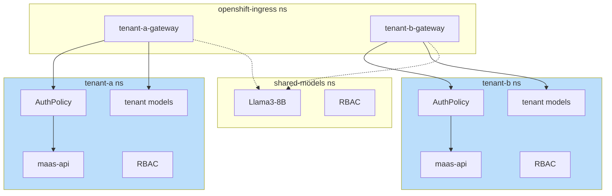

# Multi-Tenant Architecture

## Overview

This PoC demonstrates a multi-tenant Model-as-a-Service architecture where **each tenant is isolated by namespace**. The namespace boundary provides:

- AuthPolicy validating JWT issuer matches the tenant's Keycloak realm
- MaaS API instance for model discovery
- Tenant-specific models and RBAC

Gateways live in `openshift-ingress` namespace but route to tenant-specific resources.

## Tenant Boundary

In this setup, **namespace = tenant boundary**:

| Namespace | Purpose |
|-----------|---------|
| `openshift-ingress` | Gateways (tenant-a-gateway, tenant-b-gateway) |
| `tenant-a` | Tenant A's models, maas-api, policies, RBAC |
| `tenant-b` | Tenant B's models, maas-api, policies, RBAC |
| `shared-models` | Models accessible by multiple tenants |
| `keycloak` | Authentication (realms per tenant) |

## Deployment Components

## Cross-Tenant Access

Tenants **cannot** access each other's resources:

- AuthPolicy rejects JWTs from wrong realm (issuer mismatch)
- Gateways only route to their own namespace + explicitly shared models
- RBAC binds tier service accounts per tenant

Shared models explicitly grant access to specific tenant service accounts via RoleBindings.
