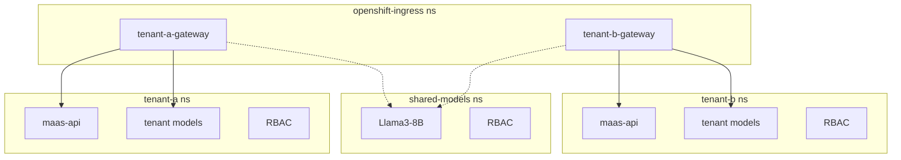

# Multi-Tenant Architecture

## What is a Tenant?

A **tenant** is an independent organizational unit (e.g., a company, department, or team) that:

- Has their own users (via Keycloak realm or other IdP)
- Gets their own models or access to shared models
- Has their own tier definitions (e.g., free/premium/enterprise) that define rate limits
- Should be isolated from other tenants (cannot see or access each other's resources)

In this PoC, a tenant is confined to a namespace, but this boundary can be expanded if needed.

## Summary

This PoC demonstrates a multi-tenant Model-as-a-Service architecture where **each tenant is isolated by namespace**. The namespace boundary provides:

- AuthPolicy validating JWT issuer matches the tenant's Keycloak realm
- MaaS API instance providing:
  - Scoped tenant-specific inference token issuance
  - Model listing with authorization checks
  - Tenant-defined tiers mapping
- Tenant-specific models and RBAC

Gateways live in `openshift-ingress` namespace but route to tenant-specific resources.

## Tenant Boundary

In this setup, **namespace = tenant boundary**:

| Namespace | Purpose |
|-----------|---------|
| `openshift-ingress` | Gateways (tenant-a-gateway, tenant-b-gateway) |
| `tenant-a` | Tenant A's models, maas-api, policies, RBAC |
| `tenant-b` | Tenant B's models, maas-api, policies, RBAC |
| `shared-models` | Models accessible by multiple tenants |
| `keycloak` | Authentication (realms per tenant) |


## Architecture Overview



## Cross-Tenant Access

Tenants **cannot** access each other's resources:

- AuthPolicy rejects JWTs from wrong realm (issuer mismatch)
- Inference tokens are scoped to tenant-specific audiences
- Gateways only route to their own namespace + explicitly shared models
- RBAC binds tier service accounts per tenant

Shared models explicitly grant access to specific tenant service accounts via RoleBindings.

## Architecture Comparison: Per-Tenant vs Single MaaS API

This PoC uses a **per-tenant MaaS API** approach. An alternative is a **single shared MaaS API** for all tenants. Here's how they compare:

| Aspect | Per-Tenant MaaS API (this PoC) | Single MaaS API |
|--------|-------------------------------|-----------------|
| **Tenant identification** | Implicit (namespace boundary) | Explicit (JWT claim, path, or header) |
| **JWT validation** | Single issuer per instance | Must accept multiple issuers or shared realm |
| **AuthPolicy** | Simple issuer match | Must extract & validate tenant context from token |
| **Model discovery** | Namespace-scoped automatically | Must filter by tenant identity at query time |
| **RBAC scope** | MaaS API SA per tenant | Single SA needs cross-namespace access + tenant filtering |
| **Tier mappings** | ConfigMap per tenant | Multi-tenant ConfigMap |
| **Token audiences** | Tenant-scoped | Shared (must encode tenant identity in token) |

**Per-tenant approach benefits:**
- Simpler security model - AuthPolicy validates JWT issuer matches tenant's realm
- Stronger isolation - misconfiguration in one tenant doesn't affect others
- Flexible customization - tiers, rate limits, policies can differ per tenant
- Independent scaling - each tenant's MaaS API scales based on their load

**Trade-off:** More resources (one `maas-api` per tenant) vs. single-endpoint which is more resource-efficient but might require tenant-aware filtering logic in the application layer.

## Personas

### Platform Administrator

Manages the overall MaaS platform infrastructure:

- Create/delete tenants (namespaces, gateways)
- Manage cluster-level resources (GatewayClass, operators)
- Configure AuthPolicies
- Deploy and manage shared models

### Tenant Administrator

Manages resources **within their tenant namespace**:

| Can Do | Cannot Do |
|--------|-----------|
| Deploy, configure, remove tenant-specific models | Access other tenant namespaces |
| Manage Role/RoleBindings for model access | Modify Gateways or cluster-level resources |
| Configure RateLimitPolicy per tier | Change AuthPolicies |
| Update tier mappings (group → tier ConfigMap) | Deploy to shared-models namespace |
| View metrics, logs, and usage for their tenant | |

> **Note:** Shared models are managed by Platform Administrators. Tenant Administrators can request access to shared models, but the access grant (RoleBinding in `shared-models` namespace) is a platform-level operation.

## Policy Granularity

Policies can be applied at different levels:

1. **Per-tenant policies** - defined for tenant's gateway, apply to all models within the tenant. Currently, Kuadrant policies use `LocalPolicyTargetReference` which requires policies to reside in the Gateway namespace (`openshift-ingress`), not the tenant namespace.
2. **Per-model policies** - attached to model's HTTPRoute, take precedence over tenant policies.

This allows both tenant-wide defaults and model-specific overrides for rate limiting, authentication, etc.

## Open Questions

- **Billing/Monitoring** - How to track and attribute usage per tenant? (metrics, logs, cost allocation)
- **Shared models governance** - Who approves tenant access to shared models? What's the request workflow?
- **Sub-tenant granularity** - Should tenants be able to create sub-groups or sub-tiers?
- **Policy namespace location** - Kuadrant's `LocalPolicyTargetReference` requires policies to be in the Gateway namespace (`openshift-ingress`), not the tenant namespace. This limits tenant admin's ability to self-manage policies. Can this be addressed with cross-namespace policy references?

## Adding a New Tenant 

The architecture is designed for easy extensibility via Kustomize. To add a new tenant (e.g., `tenant-c`):

1. **Copy tenant folder**: `cp -r manifests/tenants/tenant-a manifests/tenants/tenant-c`
2. **Update `params.env`**: Set tenant-specific values (instance-name, gateway-name, audiences, URLs)
3. **Create gateway**: Add `tenant-c-gateway.yaml` in `manifests/gateways/`
4. **Configure Keycloak realm**: Add realm configuration for tenant-c

The shared base components (`maas-api/`, `maas-api-replacements/`, `policies/`) are automatically reused—only tenant-specific configuration needs to be provided.

### Cross-Namespace Model Access

The namespace boundary is flexible - models can live outside the tenant namespace and still be accessible through the tenant's gateway:

1. **Gateway routing**: Each gateway's `allowedRoutes.namespaces.selector` defines which namespaces can route through it:
   ```yaml
   allowedRoutes:
     namespaces:
       from: Selector
       selector:
         matchExpressions:
         - key: kubernetes.io/metadata.name
           operator: In
           values:
           - tenant-a      # Tenant's own namespace
           - shared-models # External model namespace
   ```

2. **Cross-namespace RBAC**: Grant tenant service accounts access to models in other namespaces via RoleBindings that reference the tenant's tier groups.

This allows scenarios like shared models (accessible by multiple tenants) or partner model namespaces while maintaining tenant isolation for billing and authentication.