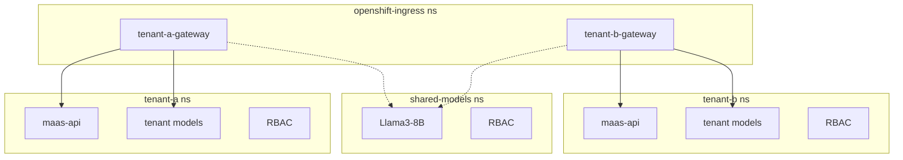

# Multi-Tenant Architecture

## Summary

This PoC demonstrates a multi-tenant Model-as-a-Service architecture where **each tenant is isolated by namespace**. The namespace boundary provides:

- AuthPolicy validating JWT issuer matches the tenant's Keycloak realm
- MaaS API instance providing:
  - Scoped tenant-specific inference token issuance
  - Model listing with authorization checks
  - Tenant-defined tiers mapping
- Tenant-specific models and RBAC

Gateways live in `openshift-ingress` namespace but route to tenant-specific resources.

## Tenant Boundary

In this setup, **namespace = tenant boundary**:

| Namespace | Purpose |
|-----------|---------|
| `openshift-ingress` | Gateways (tenant-a-gateway, tenant-b-gateway) |
| `tenant-a` | Tenant A's models, maas-api, policies, RBAC |
| `tenant-b` | Tenant B's models, maas-api, policies, RBAC |
| `shared-models` | Models accessible by multiple tenants |
| `keycloak` | Authentication (realms per tenant) |

### Adding a New Tenant

The architecture is designed for easy extensibility via Kustomize. To add a new tenant (e.g., `tenant-c`):

1. **Copy tenant folder**: `cp -r manifests/tenants/tenant-a manifests/tenants/tenant-c`
2. **Update `params.env`**: Set tenant-specific values (instance-name, gateway-name, audiences, URLs)
3. **Create gateway**: Add `tenant-c-gateway.yaml` in `manifests/gateways/`
4. **Configure Keycloak realm**: Add realm configuration for tenant-c

The shared base components (`maas-api/`, `maas-api-replacements/`, `policies/`) are automatically reused—only tenant-specific configuration needs to be provided.

### Cross-Namespace Model Access

The namespace boundary is flexible — models can live outside the tenant namespace and still be accessible through the tenant's gateway:

1. **Gateway routing**: Each gateway's `allowedRoutes.namespaces.selector` defines which namespaces can route through it:
   ```yaml
   allowedRoutes:
     namespaces:
       from: Selector
       selector:
         matchExpressions:
         - key: kubernetes.io/metadata.name
           operator: In
           values:
           - tenant-a      # Tenant's own namespace
           - shared-models # External model namespace
   ```

2. **Cross-namespace RBAC**: Grant tenant service accounts access to models in other namespaces via RoleBindings that reference the tenant's tier groups.

This allows scenarios like shared models (accessible by multiple tenants) or partner model namespaces while maintaining tenant isolation for billing and authentication.

## Architecture Overview



## Cross-Tenant Access

Tenants **cannot** access each other's resources:

- AuthPolicy rejects JWTs from wrong realm (issuer mismatch)
- Inference tokens are scoped to tenant-specific audiences
- Gateways only route to their own namespace + explicitly shared models
- RBAC binds tier service accounts per tenant

Shared models explicitly grant access to specific tenant service accounts via RoleBindings.
